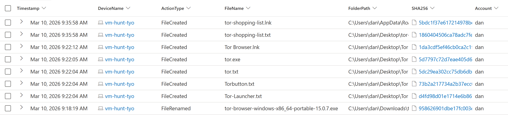
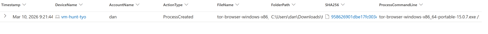
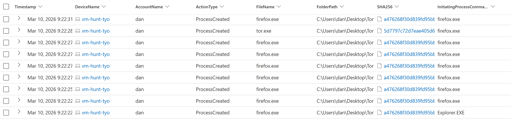
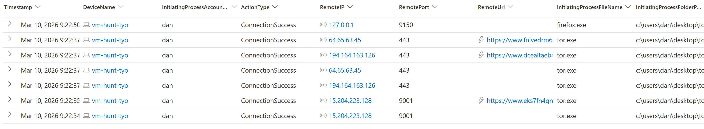

# SOC Threat Hunting & Incident Investigation: Tor Browser Activity

**Analyst:** Dan Chui  
**Date:** March 10, 2026  
**Environment:** Microsoft Defender XDR Advanced Hunting  
**Device:** vm-hunt-tyo  
**User:** dan  

---

## Deliverables 📄

👉 An Executive Summary Report can be downloaded via my cybersecurity blog, [Happy Bytes](https://happy-bytes.vercel.app/blogs/threat_hunt_tor) 

- Viewable on GitHub: [Tor Threat Hunting Summary Report (PDF)](report/Tor_Threat_Hunting_Summary_Report.pdf)

---

⚠️ Educational / Defensive Security Disclaimer

This repository contains cybersecurity learning exercises and defensive
security analysis. The materials document investigations, threat hunting,
or incident response scenarios for educational and portfolio purposes.

No malware, exploits, or offensive tooling are distributed in this repository.
Any IP addresses, indicators, or artifacts are included strictly for analysis
and educational demonstration.

- [Scenario creation](https://github.com/dan-chui/threat-hunting-scenario-tor)

---

## Overview

During a proactive threat hunting exercise, suspicious Tor Browser activity was identified on endpoint **vm-hunt-tyo** associated with user **dan**.

Analysis of Microsoft Defender XDR telemetry confirmed download, execution, browser launch, and outbound communication consistent with Tor relay usage. The activity was assessed as non-malicious but a likely policy violation and was escalated for review.

---

## Incident Summary (SOC Ticket)

| Field | Value |
|------|------|
| Ticket ID | INC-2026-0310-TOR |
| Detection Source | Microsoft Defender XDR |
| Alert Type | Suspicious Application (Tor Browser) |
| Severity | Medium |
| Status | Escalated |
| Analyst | Dan Chui |
| Device | vm-hunt-tyo |
| User | dan |

### Initial Assessment
Detection of Tor Browser installation and outbound connections to known Tor relay infrastructure. Activity may indicate policy violation or anonymized external communication.

### Actions Taken
- Investigated file download and execution events
- Correlated process and network telemetry
- Confirmed Tor execution and relay communication
- Assessed impact and potential risk
- Escalated for further review

### Disposition
Activity assessed as non-malicious but potentially policy-violating. Escalated to the security team for validation and containment decision.

---

## Investigation Objectives

The goal of this hunt was to determine:

- Whether Tor software was downloaded
- If Tor was installed and executed
- Whether the endpoint connected to Tor relay infrastructure
- If artifacts related to Tor activity were created on the system

---

## Data Sources

The investigation used the following Microsoft Defender Advanced Hunting tables:

| Log Source | Purpose |
|---|---|
| DeviceFileEvents | Identify Tor downloads and file creation |
| DeviceProcessEvents | Detect installer execution and Tor processes |
| DeviceNetworkEvents | Detect Tor network communications |

---

## Alert Triage

Upon detection, the alert was triaged to determine legitimacy and severity.

### Key Questions
- Is the activity authorized?
- Is there evidence of malicious intent?
- Does the activity indicate data exfiltration or lateral movement?

### Findings
- Application identified as Tor Browser (anonymization tool)
- No evidence of privilege escalation or persistence
- Network connections aligned with Tor relay behavior
- Activity considered suspicious but not inherently malicious

### Severity Rationale
Assigned **Medium severity** due to:
- Use of anonymization tools
- Potential policy violation
- External encrypted communication

---

## Timeline of Events

### 1. Tor Installer Downloaded

**Timestamp:** 2026-03-10 00:18:19 UTC  

File downloaded:

```
tor-browser-windows-x86_64-portable-15.0.7.exe
```

This file was downloaded to the user's **Downloads directory**, marking the beginning of Tor-related activity.



---

### 2. Tor Installer Executed

**Timestamp:** 2026-03-10 00:21:44 UTC  

The installer was executed from the Downloads folder.

Process observed:

```
tor-browser-windows-x86_64-portable-15.0.7.exe
```

Execution triggered extraction of Tor browser files.



---

### 3. Tor Files Extracted

**Timestamp:** 00:22:04 – 00:22:12 UTC  

Multiple Tor application files were created on the **Desktop**, confirming the Tor browser was successfully unpacked.



---

### 4. Tor Browser Launched

**Timestamp:** 2026-03-10 00:22:22 UTC  

Processes spawned:

```
tor.exe
firefox.exe
```

These processes indicate the Tor Browser was actively launched.

---

### 5. Connection to Tor Network

**Timestamp:** 2026-03-10 00:22:34 UTC  

Network connection observed:

| Field | Value |
|---|---|
| Remote IP | 15.204.223.128 |
| Port | 9001 |
| Process | tor.exe |

Port **9001** is commonly associated with Tor relay communications.

Additional encrypted connections over **port 443** were also observed.



---

### 6. Continued Tor Activity

**Timestamp Range:** 00:22:37 – 00:27:54 UTC  

Multiple Tor processes remained active and additional outbound network connections occurred.

---

### 7. File Artifact Created

**Timestamp:** 2026-03-10 00:35:58 UTC  

File created:

```
tor-shopping-list.txt
```

This file was created on the Desktop after Tor activity was observed and may represent a user-created artifact associated with the session.


---

## Indicators of Interest

| Type | Indicator |
|---|---|
| File | tor-browser-windows-x86_64-portable-15.0.7.exe |
| File | tor-shopping-list.txt |
| Process | tor.exe |
| Process | firefox.exe |
| IP Address | 15.204.223.128 |
| Port | 9001 |

---

## MITRE ATT&CK Mapping

| Technique | ID |
|---|---|
| User Execution | T1204 |
| Ingress Tool Transfer | T1105 |
| Application Layer Protocol | T1071 |
| Encrypted Channel | T1573 |

---

## Detection Queries

### Identify Tor File Activity

```kql
DeviceFileEvents
| where DeviceName == "vm-hunt-tyo"
| where InitiatingProcessAccountName == "dan"
| where FileName startswith "tor"
```

### Identify Tor Process Execution

```kql
DeviceProcessEvents
| where ProcessCommandLine contains "tor-browser"
```

### Identify Tor Network Connections

```kql
DeviceNetworkEvents
| where InitiatingProcessFileName in ("tor.exe","firefox.exe")
| where RemotePort in ("9001","9030","9040","9050","9051","9150","80","443")
```

---

## Security Assessment

The investigation confirmed successful download, execution, and use of Tor Browser, including outbound communication to Tor-related infrastructure.

No evidence of privilege escalation, persistence, or malware execution was observed during the review window. However, the use of anonymization software in an enterprise environment may represent a policy violation and warrants review.

---

## Escalation Decision

The activity was escalated based on the following criteria:

- Use of anonymization software within enterprise environment
- External network communication to Tor relay nodes
- Potential violation of acceptable use policy

### Analyst Notes
No evidence of lateral movement or follow-on malicious activity was identified during the observed timeframe; escalation was based on policy and visibility risk rather than confirmed compromise.

### Escalation Path
Tier 1 Analyst → Tier 2 / Security Team

### Recommended Actions
- Validate user intent
- Confirm policy enforcement requirements
- Consider endpoint isolation if unauthorized use is confirmed

---

## Recommendations

### Endpoint Controls

- Restrict installation of anonymizing tools such as Tor
- Implement application allow‑listing where possible

### Monitoring

Implement alerts for:

- Tor process execution (`tor.exe`)
- Connections to common Tor ports
- Downloads of Tor installer packages

### Network Controls

Consider blocking outbound connections to common Tor relay ports:

```
9001
9030
9050
9051
9150
```

---

## Conclusion

This investigation demonstrates a structured SOC workflow including alert triage, investigation, severity assessment, and escalation based on endpoint telemetry.

The activity shows a clear sequence:

1. Tor downloaded
2. Installer executed
3. Browser launched
4. Tor network connection established
5. User artifact created

Threat hunting techniques such as these help security teams detect potential policy violations and improve defensive monitoring.

---

## License
This project is intended for **educational and portfolio demonstration purposes**.

---

## Contact 📬

Feel free to connect on [LinkedIn](https://www.linkedin.com/in/danchui/) or review my other security projects.

*Feedback and discussion are welcome. Thank you for reviewing this project.* 🙏
